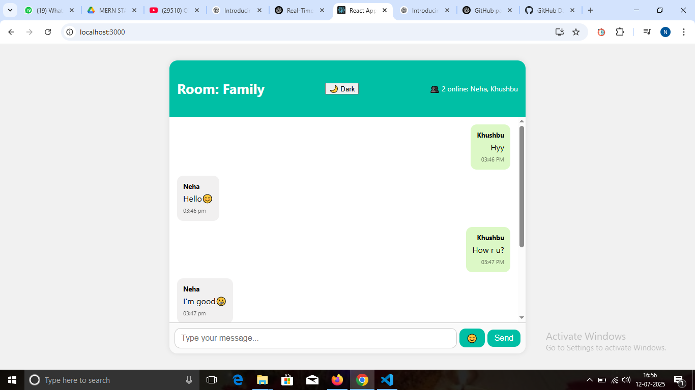
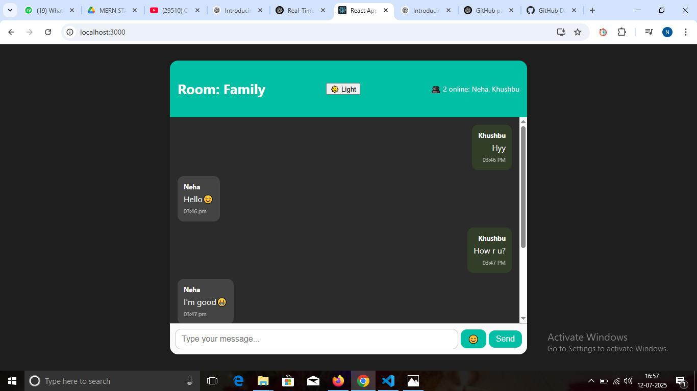

# 💬 REAL-TIME CHAT APP

A real-time chat application built using **React.js**, **Node.js**, **Express.js**, and **Socket.IO**. This project enables multiple users to join a chat room and exchange messages instantly.

---

## 📌 PROJECT DETAILS

- **Company**: CODTECH IT SOLUTIONS  
- **Name**: Neha Shukla  
- **Intern ID**: CT06DF671  
- **Domain**: MERN Stack Web Development  
- **Duration**: 6 Weeks  
- **Mentor**: Neela Santosh Kumar  

---

## 📸 OUTPUT SCREENSHOTS

| Login Screen              | Chat Interface            |
|---------------------------|----------------------------|
|   |    |

---

## 🚀 FEATURES

- Real-time messaging with multiple users
- Room-based chat
- Join/leave message notifications
- Emoji support (if added)
- Simple & responsive UI

---

## 🛠 TECH STACK

| Technology   | Description           |
|--------------|------------------------|
| React.js     | Frontend Framework     |
| Node.js      | Backend Runtime        |
| Express.js   | Web Framework          |
| Socket.IO    | Real-time Communication|

---

## 📂 FOLDER STRUCTURE

REAL-TIME-CHAT-APP/
│
├── backend/
│ ├── server.js
│ └── package.json
│
├── frontend/
│ ├── public/
│ ├── src/
│ ├── package.json
│ └── README.md
│
├── output1.png
├── output2.png
└── README.md

## 📦 HOW TO RUN LOCALLY

1. **Clone the repository**

git clone https://github.com/NehaShukla5237/REAL-TIME-CHAT-APP.git
cd REAL-TIME-CHAT-APP 

Start Backend

cd backend
npm install
node server.js

Start Frontend

cd ../frontend
npm install
npm start
Open browser and go to:
👉 http://localhost:3000

👩‍💻 DEVELOPER INFO

Name: Neha Shukla
Email: nehashukla5237@gmail.com
GitHub: github.com/NehaShukla5237

🙌 ACKNOWLEDGEMENTS

Special thanks to CodTech IT Solutions and mentor Neela Santosh Kumar for guidance and support throughout the internship.
